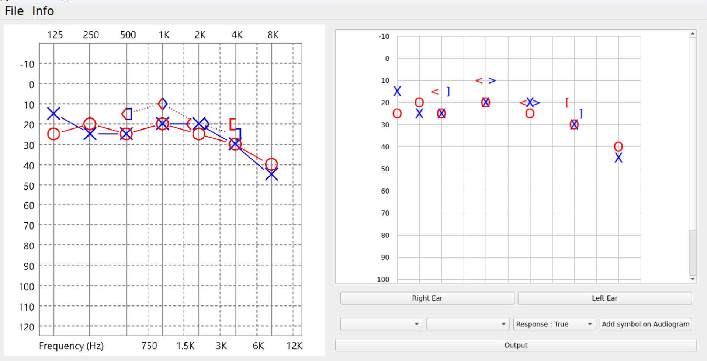

# Data Checker for the Establishment of National Taiwan University Hospital Plan Project
Author: [Wu Wei Cheng](weicheng@cmlab.csie.ntu.edu.tw)

## Enviroment
If you would like to set up the enviroment using anaconda, simply type `make` in the shell.  
This will create a enviroment called Ear_Project with the package this project need.

You can also use the command `pip install -r requirements.txt` to update the packages if you need.

### Environment problem resolve
If you encounter any problem opening this app, please delete the environment and create the environment as follow.
```
conda create --name=Ear_Project python=3.10
conda activate Ear_Project
pip install PyQt5
pip install panda
# pip uninstall opencv-python (If you have this install previous automatically)
pip install opencv-python-headless
# sudo apt install libxcb-* (If you are using remote ssh with x11 forwardin)
# conda install -c conda-forge gcc (If you are using remote ssh with x11 forwardin)
```
```
sudo apt-get install tesseract-ocr
```
## How to use
You will have to first inference using the Audiogram digitization Project and get the output data.
With the data, you will only be able to open it up with this application.

### Open the application
run the following command to open up the Application
```shell
# make sure you are under the Data_Checker Folder
python Data_checker_drag.py -i /path/to/firectory/of/image/file -j /path/to/firectory/of/json/file
# Example
python Data_checker_drag.py -i ../Ear_Model/test_set/ -j ../Ear_Model/output_HSV_bbox_1111/
```

### Layout
The table on the right hand side could be a liitle crowd if your computer screen is smaller.


### Hot Key
- `ALT + left`: previous file
- `ALT + right`: Next file

### Output
Once you press the output button, the application will only create a new file `old_file_new.json` in the same file directory as old file.  
If you are modifying the `_new.json` it will automatically overwrite it.